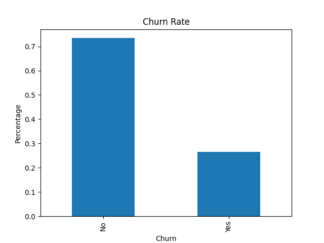

# Customer Churn Analysis

## Overview
This project analyzes customer churn data using Python to understand why customers leave.

## Tools
- Python
- Pandas
- Matplotlib

## Dataset
- Telco Customer Churn dataset
- Contains customer demographics, services, and churn status

## What I did
- Cleaned and processed the dataset
- Converted data types and handled missing values
- Calculated overall churn rate
- Visualized churn distribution

## Results
- ~26.6% of customers churned
- Majority of customers stayed

## Output


## How to Run
```bash
cd data
python analysis.py
