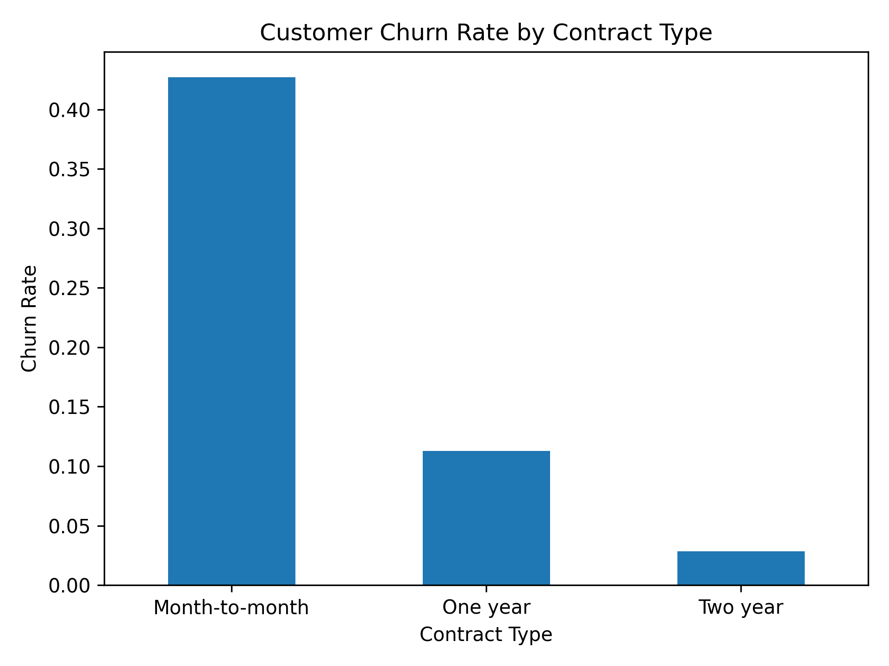

# Customer Churn Prediction | Machine Learning

## Overview

This project analyzes customer churn patterns and builds a machine learning model to identify customers at risk of leaving a telecommunications company.

The project combines exploratory data analysis, data preprocessing, visualization, and predictive modeling to transform customer data into actionable retention insights.

## Dataset

The dataset contains approximately 7,000 telecommunications customer records with information including:

- Customer demographics
- Contract type
- Monthly and total charges
- Internet and phone services
- Payment methods
- Customer tenure
- Churn status

## Tools & Technologies

- Python
- Pandas
- Matplotlib
- Scikit-learn
- Logistic Regression
- Git / GitHub

## Machine Learning Workflow

1. Loaded and cleaned customer data using Pandas.
2. Converted and handled missing or invalid values.
3. Performed exploratory analysis to identify churn patterns.
4. Prepared numerical and categorical features for machine learning.
5. Applied missing-value imputation, feature scaling, and one-hot encoding.
6. Split the data into training and testing sets.
7. Built a Logistic Regression classification model.
8. Evaluated model performance using accuracy, ROC-AUC, precision, recall, F1-score, and a confusion matrix.

## Model Performance

The Logistic Regression model achieved:

- **Accuracy: 72.6%**
- **ROC-AUC: 0.835**
- **Churn Recall: 80%**

The ROC-AUC score indicates that the model can effectively distinguish between customers who churn and customers who remain.

## Key Insights

- Customers on month-to-month contracts had the highest churn rate at approximately **43%**.
- Customers with one-year contracts had substantially lower churn at approximately **11%**.
- Customers with two-year contracts had the lowest churn rate at approximately **3%**.
- Contract duration is therefore strongly associated with customer retention.
- The predictive model can help identify high-risk customers who may benefit from targeted retention strategies.

## Visualization



The visualization shows a significant decline in churn as contract length increases.

## Business Application

A telecommunications company could use this analysis to prioritize high-risk customers for retention campaigns. Customers on month-to-month contracts could be targeted with incentives to transition to longer-term plans, while churn probabilities from the predictive model could help allocate retention resources more efficiently.

## Project Structure

```text
churn-analysis-python/
├── data/
│   ├── Churn.csv
│   ├── analysis.py
│   └── churn_chart.png
├── churn_by_contract.png
└── README.md
```

## Future Improvements

- Compare Logistic Regression with Random Forest and Gradient Boosting models.
- Perform hyperparameter tuning and cross-validation.
- Analyze feature importance and model explainability.
- Develop an interactive churn prediction application.
